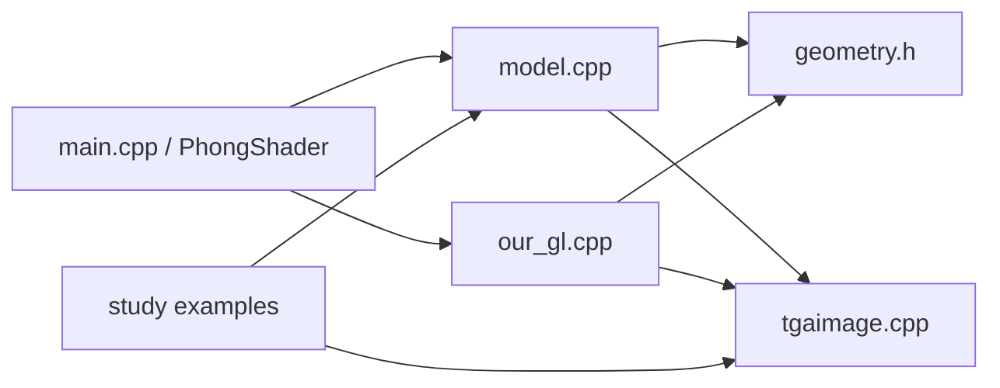
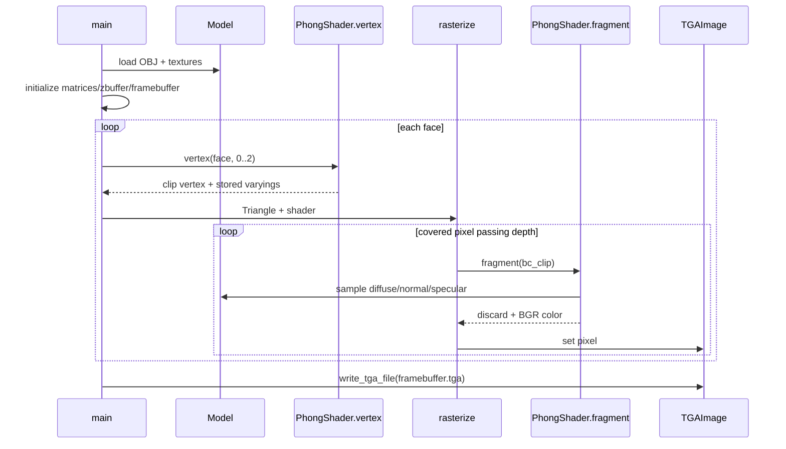
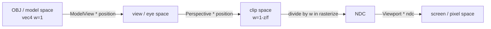
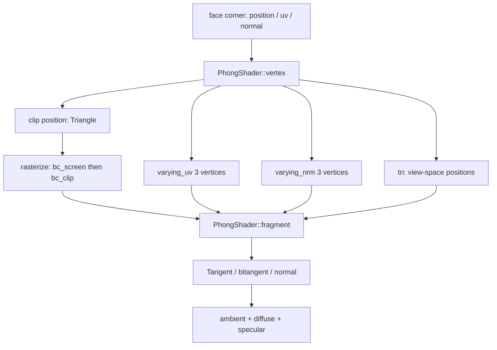

# tinyRenderer 架构与代码学习指南

## 1. 项目定位与执行基线

这是一个 **CPU software renderer**：程序不创建实时窗口，也不调用 OpenGL、Vulkan、Metal 或 DirectX。它用普通 C++ 函数和内存数组模拟顶点处理、图元装配、光栅化、片元着色、深度测试与颜色附件，因此适合先看清图形 API 隐藏在驱动和 GPU 后的基本数据流。

CMake 生成四个可执行目标：最终渲染器 `tinyrenderer`，以及递进示例 `print`、`rasterize`、`rasterize2`。主程序接受一个或多个已经三角化的 OBJ 路径，所有模型顺序画入同一张 800×800 framebuffer，最终写出 `framebuffer.tga`。

本次修改前的参考命令为：

```sh
build/tinyrenderer obj/diablo3_pose/diablo3_pose.obj obj/floor.obj
```

其基线输出为 800×800、24-bit RLE TGA，文件大小 387142 字节，SHA-256 为 `6b0579d711b038080f23573557d34c692bb52e1f6d4efa17b16b8f70e26f9a42`。

## 2. 模块职责

| 模块 | 文件 | 输入 | 输出 | 职责 | 对应 GPU 阶段 |
|---|---|---|---|---|---|
| 构建/入口 | `CMakeLists.txt`, `main.cpp` | 参数、模型路径 | 一帧 TGA | 建目标、配置场景、驱动帧循环 | 应用/命令提交 |
| 数学 | `geometry.h` | 向量、矩阵 | 运算结果 | 点积、叉积、归一化、行列式与求逆 | Shader 数学运算 |
| OBJ/纹理加载 | `model.*` | OBJ/TGA | 顶点、索引、纹理 | 解析 `v/vt/vn/f` 并按后缀加载纹理 | Vertex/index/texture resources |
| 相机与变换 | `our_gl.cpp` | eye/center/up | 全局矩阵 | 构造 ModelView、Perspective、Viewport | 固定状态/变换 |
| 顶点着色 | `PhongShader::vertex` | 面角点 | clip 顶点、varying | 位置和法线变换、输出 UV | Vertex Shader |
| 图元装配 | `main` 的 `Triangle` | 三个 clip 顶点 | 有序三角形 | 每三个着色后顶点组成图元 | Primitive Assembly |
| 光栅化 | `rasterize` | clip 三角形 | 候选片元 | 透视除法、视口、剔除、包围盒覆盖 | Rasterizer |
| 透视校正 | `rasterize` | `bc_screen`, clip.w | `bc_clip` | 对 varying 的权重作 1/w 校正 | Perspective interpolation |
| 片元着色 | `PhongShader::fragment` | `bc_clip`、纹理 | `TGAColor`/discard | TBN 法线贴图和 Phong 光照 | Fragment Shader |
| 深度测试 | `rasterize`, `zbuffer` | 插值 NDC z | 通过/拒绝 | 软件 Z-Buffer，较大 z 获胜 | Depth test/attachment |
| Framebuffer | `TGAImage framebuffer` | 片元颜色 | BGR 字节数组 | 内存颜色附件 | Color attachment |
| TGA 编解码 | `tgaimage.*` | TGA/像素数组 | 像素数组/TGA | 原始与 RLE 路径、方向规范化 | Readback/离线输出 |
| 学习示例 | `study/*` | 点、线、三角形/OBJ | 小型 TGA | 从画线逐步过渡到覆盖判断 | 管线的局部练习 |

## 3. 完整调用链

`main` → 逐参数构造 `Model` → 解析 OBJ 并加载 `_diffuse.tga`、`_nm_tangent.tga`、`_spec.tga` → `lookat` / `init_perspective` / `init_viewport` / `init_zbuffer` → 遍历 Model → 遍历 Face → 三次 `PhongShader::vertex` → `Triangle clip[3]` 图元装配 → `rasterize` → clip/w 得 NDC → Viewport 得 screen → 有符号面积剔除 → Bounding Box → `ABC.invert_transpose()` 得 `bc_screen` → 深度测试 → 1/w 得 `bc_clip` → `PhongShader::fragment` → UV/法线/高光纹理采样 → framebuffer → `write_tga_file` → `framebuffer.tga`。

一帧不是实时循环：上述流程只执行一次。若输入多个 OBJ，它们共享同一深度缓冲，所以能互相遮挡。

## 4. 架构与数据流图

### 4.1 模块依赖



### 4.2 一帧渲染时序



### 4.3 坐标空间



这里的 `ModelView` 实际是以 `center` 为平移基准的课程相机；`Perspective` 只改变 w；Viewport 只缩放/平移 x、y。项目没有实现标准 GPU 的裁剪器、near/far 平面或完整 clip volume，越界部分仅靠屏幕包围盒裁切。

### 4.4 varying 数据流



## 5. 数学约定与关键算法

### 5.1 向量、齐次坐标和矩阵

`vec2` 用于 UV/屏幕点，`vec3` 用于普通三维量及重心坐标，`vec4` 用于齐次位置和方向。OBJ 位置被加载为 w=1；法线和光方向为 w=0，使平移不影响方向。`operator*` 在两个向量之间表示点积；`cross` 生成垂直方向；`normalized` 除以长度，要求非零输入。

`mat<R,C>` 是 **R 行 C 列且按行存储**。主变换写成 `mat * vec`，向量按列参与计算；`vec * mat` 也存在，语义是行向量乘矩阵。矩阵乘法遵循 `(A*B)*v = A*(B*v)`。

行列式由第一行递归作 Laplace 展开：`cofactor` 构造子式并附加符号；余子式矩阵除以 determinant 得 inverse-transpose；再转置得到 inverse。任何 determinant 为零或接近零的矩阵都会产生除零或数值不稳定：可能包括退化屏幕三角形的 `ABC`、退化 UV 的 `U` 以及用户自行构造的奇异变换。当前代码仅在求 `ABC` 逆前用面积阈值排除一部分情况。

法线使用 `ModelView.invert_transpose()`，因为位置变换对切向量施加 M 后，要保持新法线与新切线正交，法线需施加 `(M^-1)^T`。当前 ModelView 只有正交旋转和平移时它可简化为旋转，但保留逆转置展示了更一般的规则。

### 5.2 覆盖、重心与深度

屏幕三点作为 `ABC` 的三行。像素 p 的重心坐标满足 `ABC^T * bc = p`，因此实现采用 `ABC.invert_transpose() * p`，并非随意将常见公式转置。任一分量为负表示点位于对应对边之外。`det(ABC)<1` 将背面、退化面以及投影面积不足约半个像素的正面同时丢弃；真实 GPU 通常将绕序剔除和覆盖规则配置为独立状态。

`bc_screen` 是屏幕平面上的仿射重心坐标。UV、法线等 varying 若直接使用它会在透视投影下扭曲，所以每个权重除以对应 clip.w 后重新归一化成 `bc_clip`。片元着色器使用 `bc_clip`；深度则以 `bc_screen` 线性插值三个顶点的 NDC z。当前 zbuffer 初值为 -1000，较大的 z 胜出，这是一项项目约定，不能直接套用某个 GPU API 默认深度范围/比较函数。

片元着色器返回 `discard=true` 时，颜色和深度都不写；当前 PhongShader 始终返回 false。OpenMP 只并行单个三角形包围盒的 x 列，不同线程访问不同像素；外层三角形仍串行。若将面循环也并行化，对同一 zbuffer/color 像素的“比较后写入”将产生数据竞争。

## 6. OBJ、纹理、TGA 与光照

OBJ 的 `v`、`vt`、`vn` 分别存入三个数组，`f` 的每个 `v/vt/vn` 角点则分别存入三条索引流，因为 OBJ 三种索引空间本来就可不同。解析器只接受恰好三个角点的面，输入须预先三角化；索引从 OBJ 的 1 基转成 C++ 的 0 基。UV 的 V 在加载时转换为 `1-v`，以匹配读入后规范化的 TGA 行方向。

纹理名由移除 `.obj` 扩展名后追加固定后缀得到。采样器是最近邻：UV 乘 width/height 后隐式截断，没有过滤、mipmap 或 wrap。边界 UV=1 会得到越界的默认黑色，这是教学简化。

`TGAColor` 内存顺序为 B、G、R、A。因此法线贴图读取时用 `c[2],c[1],c[0]` 恢复 RGB，映射到 [-1,1] 并归一化。TGA 读入的类型 2/3 是原始数据，10/11 是 RLE；写出同样支持原始与 RLE。描述符中的原点位用于将输入统一为内存左上原点，默认输出则声明/写为底部原点方向。

片元阶段先由观察空间三角形边 `E` 与 UV 边 `U` 求 tangent、bitangent，再与插值法线构成 Darboux/TBN 标架。切线空间法线经该标架的转置变到观察空间。环境项给最低亮度；漫反射是 `max(n·l,0)`；反射向量 `r=2n(n·l)-l`；高光取 `r.z`，因为代码把观察方向简化为观察空间 +Z 轴。diffuse map 决定基础颜色，normal map 改变逐像素法线，specular map 调节高光强度系数（指数仍固定为 35）。这不是能量守恒的物理材质，而是教学用 Phong 近似。

## 7. CPU 代码与 GPU 管线映射

| 当前项目代码 | GPU 概念 | 差异/简化 |
|---|---|---|
| `PhongShader::vertex` | Vertex Shader | CPU 虚函数，手动保存 varying |
| `Triangle clip[3]` | Primitive Assembly | OBJ 已三角化，无索引缓存复用 |
| `rasterize` | Rasterizer | CPU 包围盒与重心；无完整裁剪和 MSAA |
| `bc_clip` | Perspective interpolator | 手写 1/w 校正 |
| `shader.fragment` | Fragment Shader | CPU 每个覆盖像素调用 |
| `zbuffer` | Depth Buffer | `vector<double>`，固定 greater 比较 |
| `TGAImage framebuffer` | Framebuffer/Color Attachment | CPU BGR 字节数组 |
| `write_tga_file` | Present/Readback 的教学替代 | 输出文件，无 swapchain/窗口 |

## 8. 关键数据结构词典

| 名称 | 含义 |
|---|---|
| `vec2/vec3/vec4` | 固定维向量；分别常承载 UV/像素、三维量/重心、齐次量 |
| `mat<R,C>` | 行存储的 R×C 矩阵，支持两侧向量乘法、转置、行列式和求逆 |
| `Triangle` | 三个未透视除法的 clip-space `vec4` |
| `Model` | 单个 OBJ 的几何索引与三张 TGA 纹理所有者 |
| `TGAColor` | 最多四字节的 BGRA 像素及有效字节数 |
| `TGAImage` | 图像尺寸、每像素字节数和连续像素数据 |
| `IShader` | 提供纹理采样与 fragment 接口的最小 shader 抽象 |
| `PhongShader` | 保存当前模型、光源及跨阶段属性的具体着色器 |
| `varying` | 顶点阶段产生、片元阶段按重心坐标插值的属性 |
| `zbuffer` | 每像素一个 double 的软件深度附件 |
| `framebuffer` | 800×800 RGB `TGAImage` 颜色附件 |

## 9. 复杂度与并行范围

若 OBJ 文本长度为 L、顶点/角点总量为 V，则解析约为 O(L) 时间和 O(V) 空间；三张纹理的读取还与像素数及 RLE 包数线性相关。对三角形 t，光栅化成本约为其裁剪后屏幕包围盒面积 `A_t`，而不是仅与真正覆盖像素数相关；总成本为 `O(sum A_t)`，每个候选像素包含重心、深度，覆盖后还含纹理采样与光照。采样均为 O(1) 最近邻。

OpenMP 并行的是每个三角形的包围盒 x 循环；频繁进入并行区的调度成本、小三角形工作量不足、串行的三角形循环及内存带宽都会限制加速。当前划分避免单个三角形内部写同一像素，但不是通用的并行光栅架构。

## 10. 学习示例的递进关系

1. `study/print.cpp`：先用 `set` 理解 framebuffer，再实现按主轴步进的 Bresenham 风格直线，最后用简单正交投影画 OBJ 线框。
2. `study/rasterize.cpp`：把顶点按 y 排序，分上下两半逐扫描线插值左右端点。这是扫描线填充，**与最终 rasterize 算法不同**。
3. `study/rasterize2.cpp`：遍历二维包围盒，以鞋带公式的有向面积比例测试内部点。这引出重心思想，但示例的 alpha/beta/gamma 排列只用于同号覆盖判断，并未用于属性插值。
4. `our_gl.cpp::rasterize`：把上述覆盖思想扩展到 clip→NDC→screen、矩阵重心、透视校正、Z-Buffer 和可编程片元着色。

## 11. 分阶段阅读路线

| 阶段 | 文件/关键函数 | 建议断点 | 实验参数 | 预期观察 |
|---|---|---|---|---|
| 1 TGA 像素 | `tgaimage.*`: `set/get/write_tga_file` | `set` 边界检查 | RGB/BGRA 常量、`rle` | 通道交换或文件大小变化 |
| 2 直线 | `study/print.cpp`: `line` | steep 分支 | 端点、颜色 | 陡线发生坐标转置 |
| 3 二维填充 | 两个 `study/rasterize*` 的 `triangle` | 扫描线/面积判断 | 三角形绕序与退化点 | 覆盖边界和绕序差异 |
| 4 数学 | `geometry.h` | `operator*(mat,vec)`, `invert_transpose` | 小型手算矩阵 | 验证行列布局和乘法方向 |
| 5 OBJ | `Model::Model` | 各行前缀分支 | 换一个三角化 OBJ | v/vt/vn 数量可不同 |
| 6 变换 | `lookat`, `init_perspective`, `init_viewport` | 每个矩阵构造后 | eye、center、viewport | 构图、透视与画面占比变化 |
| 7 重心 | `rasterize` 的 `ABC` | `bc_screen` | 像素 x/y | 内部权重非负且和约为 1 |
| 8 Z-Buffer | 深度比较和写入 | `z <= zbuffer[...]` | 模型输入顺序 | 正确图像原则上不依赖提交顺序 |
| 9 Shader 抽象 | `IShader`, `PhongShader` | vertex/fragment 入口 | 临时固定 fragment 色 | 几何不变而颜色统一 |
| 10 UV/纹理 | `sample2D`, `Model::uv` | 纹理坐标转换 | 显示 UV 为颜色 | 看见透视校正后的纹理分布 |
| 11 Phong | `PhongShader::fragment` | ambient/diffuse/specular | light、ambient、指数 | 阴影侧与高光面积改变 |
| 12 法线/TBN | `U.invert()*E`, `D.transpose()` | n 变换前后 | 暂时返回几何法线 | 凹凸细节消失，可比较法线贴图贡献 |

实验应在临时分支进行；本学习注释提交本身不改变上述参数和算法。

## 12. 代码级学习索引

| 学习主题 | 入口文件/函数 | 前置知识 | 建议实验 |
|---|---|---|---|
| OBJ parsing | `model.cpp: Model::Model` | 文本流、索引 | 打印 v/vt/vn 数量及首个 face |
| TGA encoding/decoding | `read_tga_file`, `load_rle_data`, `write_tga_file` | 二进制、RLE | 分别以 raw/RLE 写同一图并比较像素 |
| Homogeneous coordinates | `geometry.h`, `Model::vert` | 仿射变换 | 比较 w=0 与 w=1 经过平移矩阵 |
| Camera/look-at | `our_gl.cpp: lookat` | 正交基、叉积 | 改 eye/center 并打印 ModelView |
| Perspective projection | `init_perspective` | clip 与 w | 记录同一顶点除 w 前后坐标 |
| Viewport mapping | `init_viewport` | NDC | 改 viewport 边距 |
| Back-face culling | `ABC.det()<1` | 绕序、有向面积 | 交换两个顶点观察消失 |
| Bounding-box rasterization | `rasterize` 的 minmax/循环 | AABB | 将 bbox 边界画成调试颜色 |
| Barycentric coordinates | `ABC.invert_transpose()` | 线性方程 | 检查三权重之和 |
| Perspective-correct interpolation | `bc_clip` | 齐次坐标 | 对比用 `bc_screen` 插值 UV 的扭曲 |
| Z-buffer | `zbuffer`, 深度比较 | 可见性 | 交换输入模型顺序 |
| Texture sampling | `IShader::sample2D` | UV、离散采样 | 用棋盘纹理观察最近邻锯齿 |
| Phong lighting | `PhongShader::fragment` | 点积、反射向量 | 单独启用三个光照项 |
| Normal mapping | `Model::normal(uv)` | BGR、[-1,1] | 将解码法线可视化为颜色 |
| Tangent space | `U`, `E`, `T`, `D` | UV 导数、基变换 | 输出 tangent/bitangent 伪彩色 |
| OpenMP rasterization | `#pragma omp parallel for` | 数据竞争 | 比较 `OMP_NUM_THREADS=1/4` 的哈希与时间 |

## 13. 实现边界

本项目没有完整的模型矩阵、clip-volume clipping、顶点缓存、纹理过滤、mipmap、可配置深度函数、alpha blending、MSAA、物理材质或实时呈现。这些差异并不妨碍学习管线阶段的因果关系，但阅读时应将“当前代码实际行为”“真实 GPU 通常提供的行为”和“课程刻意简化”严格区分。
